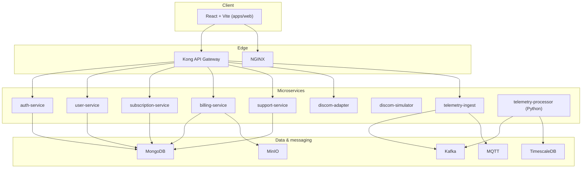

<div align="center">

# ⚡ EnergiX

### Energy-as-a-Service Platform

**Solar · Grid · Real-time telemetry · Subscriptions & billing**

[](./LICENSE.md)
[](https://nodejs.org/)
[](https://react.dev/)

*Production-oriented EaaS: microservices, streaming telemetry, and a polished React client with offline-friendly demo flows.*

---

[Key features](#-key-features) · [Architecture](#-project-architecture) · [Tech stack](#-tech-stack) · [Structure](#-project-structure) · [How it works](#-how-it-works) · [Run & test](#-how-to-run-locally-and-test-it) · [License](#-license)

</div>

---

## ✨ Key features

| Area | What you get |
|------|----------------|
| **Dashboard** | Energy overview, charts (Recharts), alerts — gated by subscription in demo mode |
| **ROI calculator** | Bill-based slider, savings estimate, tier recommendation aligned with subscription plans |
| **Subscriptions** | Tiered plans (Basic Backup, Solar+Backup, Premium Green), compare & subscribe flow |
| **Demo checkout** | Full payment UI (card + OTP) with test credentials; persists demo subscription & invoice per user |
| **Billing** | Invoice list driven by post-payment demo data in `localStorage` |
| **Auth** | Email/password, JWT access + refresh (via API client), optional Google OAuth where configured |
| **Admin & support** | Role-gated admin route; support area for tickets |
| **Backend (optional)** | Microservices for auth, users, plans, billing, support, DISCOM, telemetry ingest & processing |
| **Infrastructure** | Docker Compose for MongoDB, TimescaleDB, Kafka, MQTT, MinIO, Kong, NGINX, and more |

---

## 🏛️ Project architecture

High-level view: **React SPA** → **API gateway** → **Node/ Python services** → **databases & messaging**.



When the **backend is not running**, the web app still demonstrates **subscription, ROI, and payment** flows using **client-side demo storage** (`localStorage`).

---

## 🎯 Architecture highlights

- **Separation of concerns**: Domain services (auth, billing, telemetry, DISCOM) are isolated and can scale independently.
- **Event-driven telemetry**: IoT-style path **MQTT → Kafka → processor → TimescaleDB** for time-series energy data.
- **Polyglot where it fits**: **TypeScript/Express** for APIs, **Python/FastAPI** for telemetry processing.
- **Gateway pattern**: **Kong** + **NGINX** centralize routing, TLS termination, and cross-cutting concerns.
- **Resilient demo UX**: The SPA degrades gracefully with **demo mode** so stakeholders can try journeys without a full stack.
- **Shared contracts**: `packages/shared-types` keeps TypeScript types consistent across services and tooling.

---

## 🧰 Tech stack

### Frontend (`apps/web`)

| Layer | Technology | Notes |
|--------|------------|--------|
| **UI** | React 18, TypeScript | Functional components, strict typing |
| **Build** | Vite 5 | Fast HMR, ES modules |
| **Styling** | Tailwind CSS 3, `tailwindcss-animate` | Utility-first; consistent spacing & motion |
| **Components** | shadcn/ui (Radix UI primitives) | Accessible dialogs, tabs, dropdowns, forms |
| **Routing** | React Router v6 | Public auth routes + nested private layout |
| **State** | Zustand | Auth/session state |
| **HTTP** | Axios | Shared instance with interceptors (`VITE_API_URL`, default `http://localhost:8000`) |
| **Charts** | Recharts | Dashboard visualizations |
| **Forms** | react-hook-form | Validated forms |
| **Icons** | lucide-react | Consistent icon set |
| **Utilities** | `clsx`, `tailwind-merge`, `class-variance-authority` | Conditional classes & variants |
| **Dates** | date-fns | Formatting and manipulation |

### Backend services (Node.js / TypeScript)

| Concern | Typical stack |
|---------|----------------|
| **Runtime** | Node.js, Express |
| **Language** | TypeScript (`ts-node-dev` in dev, `tsc` build) |
| **Data** | Mongoose → MongoDB (users, subscriptions, invoices, tickets) |
| **Auth** | `jsonwebtoken`, bcrypt, `cookie-parser`, Google Auth Library |
| **Validation** | express-validator |
| **Security** | helmet, CORS |
| **Observability** | morgan, winston, prom-client (`/metrics`) |
| **Testing** | Jest, ts-jest |

### Telemetry pipeline

| Piece | Technology |
|-------|------------|
| **Ingest** | Node service bridging MQTT ↔ Kafka |
| **Processing** | Python, FastAPI (`uvicorn`), `requirements.txt` in `services/telemetry-processor` |
| **Time-series** | TimescaleDB (PostgreSQL extension) |

### Data & messaging

| Store / bus | Role |
|-------------|------|
| **MongoDB** | Document store for users, billing, subscriptions, support |
| **TimescaleDB** | Energy telemetry time-series |
| **Kafka** (+ Zookeeper in compose) | Stream processing backbone |
| **MQTT (e.g. Mosquitto)** | Device-facing telemetry |
| **MinIO** | S3-compatible objects (invoices, reports) |

### Infrastructure & ops

| Tool | Purpose |
|------|---------|
| **Docker Compose** | `infra/docker-compose.yml` — local full stack |
| **Kong** | API gateway |
| **NGINX** | Reverse proxy / static front door |
| **Kubernetes** | Manifests under `infra/k8s/` for production-style deploys |
| **Terraform** | `infra/terraform/` for IaC where defined |

---

## 📁 Project structure

```
energix/
├── apps/
│   └── web/                      # React + Vite SPA
├── services/
│   ├── auth-service/
│   ├── user-service/
│   ├── subscription-service/
│   ├── billing-service/
│   ├── support-service/
│   ├── telemetry-ingest/
│   ├── telemetry-processor/      # Python FastAPI
│   ├── discom-adapter/
│   └── discom-simulator/
├── packages/
│   └── shared-types/             # Shared TS types across services
├── infra/
│   ├── docker-compose.yml
│   ├── kong/
│   ├── nginx/
│   ├── k8s/
│   └── terraform/
├── scripts/
│   ├── device-simulator/
│   └── seed-data/
└── docs/
    ├── api-spec.md
    ├── architecture.md
    └── demo-flow.md
```

---

## 📌 Key files explained

| Path | Role |
|------|------|
| `apps/web/src/App.tsx` | Route table: `/login`, `/signup`, `/payment`, nested `Layout` with `/`, `subscription`, `roi-calculator`, `billing`, `support`, `admin` |
| `apps/web/src/main.tsx` | React root mount |
| `apps/web/src/components/Layout.tsx` | Shell (sidebar, navigation) for authenticated app |
| `apps/web/src/store/authStore.ts` | Zustand store: user, tokens, login/logout |
| `apps/web/src/services/api.ts` | Axios client, `Authorization` header, 401 refresh retry |
| `apps/web/src/lib/demoStorage.ts` | Demo `localStorage` keys: subscription, invoice, recommended plan |
| `apps/web/src/pages/DashboardPage.tsx` | Main dashboard + charts |
| `apps/web/src/pages/ROICalculatorPage.tsx` | Bill slider → savings → tier recommendation |
| `apps/web/src/pages/SubscriptionPage.tsx` | Plan cards and subscribe → `/payment` |
| `apps/web/src/pages/PaymentPage.tsx` | Demo checkout (card + OTP) |
| `apps/web/src/pages/BillingPage.tsx` | Reads per-user demo invoice after payment |
| `infra/docker-compose.yml` | All-in-one local infrastructure and service wiring |
| `docs/api-spec.md` | REST API reference for services |
| `packages/shared-types/` | Cross-service TypeScript contracts |

---

## ⚙️ How it works

1. **Authentication**  
   Users sign up or log in. The client stores JWTs (access + refresh) and attaches the access token to API calls. On **401**, the client attempts **refresh**; if that fails, the user is sent to `/login`.

2. **ROI → subscription**  
   The ROI calculator estimates savings from the user’s monthly bill and recommends a tier. **Continue with this Plan** saves the recommendation to `localStorage` and navigates to **Subscription**, where the matching card can show a **Recommended** badge.

3. **Subscribe → pay → bill**  
   **Subscribe** opens **`/payment`** with the selected plan in navigation state. After a successful **demo** payment (test card `4111 1111 1111 1111`, CVV `123`, OTP `1234`), the app writes demo subscription and invoice entries keyed by user id. **Billing** lists those invoices.

4. **Dashboard**  
   With an active demo subscription, the dashboard shows energy insights and charts. Without it, the experience may be limited until the user completes the flow.

5. **Full stack (optional)**  
   Device or simulator → **MQTT** → **telemetry-ingest** → **Kafka** → **telemetry-processor** → **TimescaleDB**. Other services persist to **MongoDB** and expose REST via **Kong** / **NGINX**.

---

## 🎬 Project demo

<!-- Add your walkthrough or promo video below. -->

| | |
|:--|:--|
| **Video** | _Add embed or link here (e.g. YouTube, Loom, or relative path to a file in the repo)._ |

**Example (replace with your URL):**

```markdown
[](https://www.youtube.com/watch?v=VIDEO_ID)
```

---

## 📸 Project in action

<!-- Add screenshots under docs/screenshots/ and reference them in the table below. -->

| Screen | Preview |
|--------|---------|
| Dashboard | __ |
| Subscription | __ |
| ROI calculator | __ |
| Payment | __ |
| Billing | __ |

_Uncomment the image lines after you add PNG/JPG files, or replace with your own paths._

---

## 🚀 How to run locally and test it

### Prerequisites

- **Node.js 20+** (LTS recommended) and **npm**
- **Docker & Docker Compose** (optional, for full stack / databases)
- **Python 3.11+** (optional, for `telemetry-processor`)

### Option A — Frontend only (fastest)

Demo flows work **without** a backend via `localStorage`.

```bash
cd apps/web
npm install
npm run dev
```

Open the URL Vite prints (usually **http://localhost:5173**). Sign up or log in, then try **Dashboard**, **ROI Calculator**, **Subscription**, **Payment**, and **Billing**.

**Quick demo path:** ROI → **Continue with this Plan** → **Subscription** → **Subscribe** → test card **`4111 1111 1111 1111`**, CVV **`123`**, OTP **`1234`** → **Billing** for the demo invoice.

| Command | Purpose |
|---------|---------|
| `npm run build` | Typecheck + production build to `dist/` |
| `npm run preview` | Serve production build locally |

### Option B — Full stack with Docker Compose

From the repo root:

```bash
cd infra
docker compose up -d
```

Inspect **ports** in `infra/docker-compose.yml` (e.g. Kong, MongoDB, Kafka, MQTT, MinIO). The web UI may be exposed via **NGINX** — often **http://localhost** depending on compose config.

### Option C — Mixed dev (infra in Docker + services + web locally)

1. `cd infra && docker compose up -d`
2. Copy each service’s `.env.example` → `.env` where needed.
3. Run services you need, e.g. `cd services/auth-service && npm install && npm run dev`
4. Run `apps/web` with `npm run dev`
5. Set **`VITE_API_URL`** if your gateway is not `http://localhost:8000`

### Testing & quality

| Area | Command |
|------|---------|
| Node service (example) | `cd services/auth-service && npm test && npm run lint` |
| Web build | `cd apps/web && npm run build` |

---

## 🔮 Future enhancements

- Deeper **real-time** dashboard (WebSockets/SSE) wired to live telemetry APIs.
- **Mobile app** or PWA shell for field installers and homeowners.
- **Payment gateway** integration (Stripe/Razorpay) replacing demo-only checkout.
- **Multi-tenant** orgs, sites, and device fleets with RBAC refinements.
- **Observability** stack: OpenTelemetry traces, centralized logs, SLO dashboards.
- **Automated E2E** tests (Playwright/Cypress) for ROI → pay → bill journeys.

---

## 📄 License

This project is licensed under the **MIT License** — see the full text in [`LICENSE.md`](./LICENSE.md).

---

<div align="center">

**EnergiX** · Built for smarter energy operations

</div>
